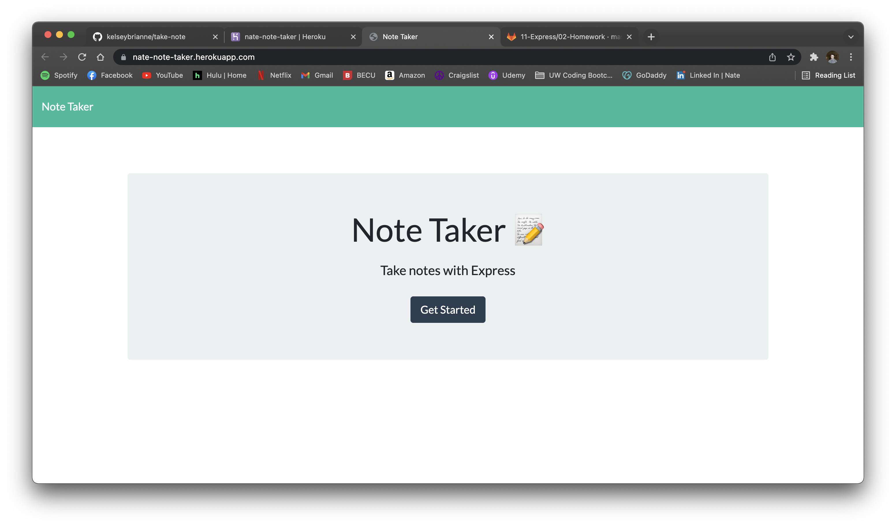
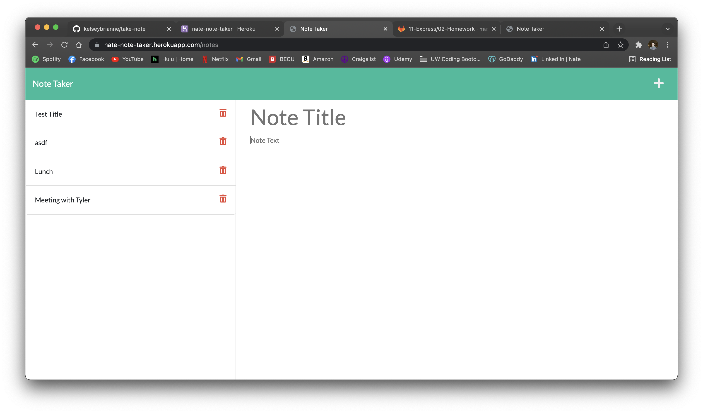

# note-taker

Homework 11 Express.js: Note Taker

## Work Done

- When the Note Taker opens, user presented with a landing page with a link to a notes page
- When you are in the note taking page, the user is able to create a note with a text body and title.
- Once the user has created a note, then he/she can save it into an ordered list on the right hand side of the screen.

## Image of Project

## Links

URL for GitHub repo: https://github.com/NateWalchenbach/note-taker

URL for app deployed on Heroku: https://nate-note-taker.herokuapp.com/notes

Thank you for reading the readme!

